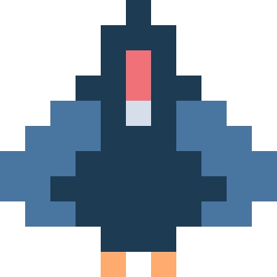
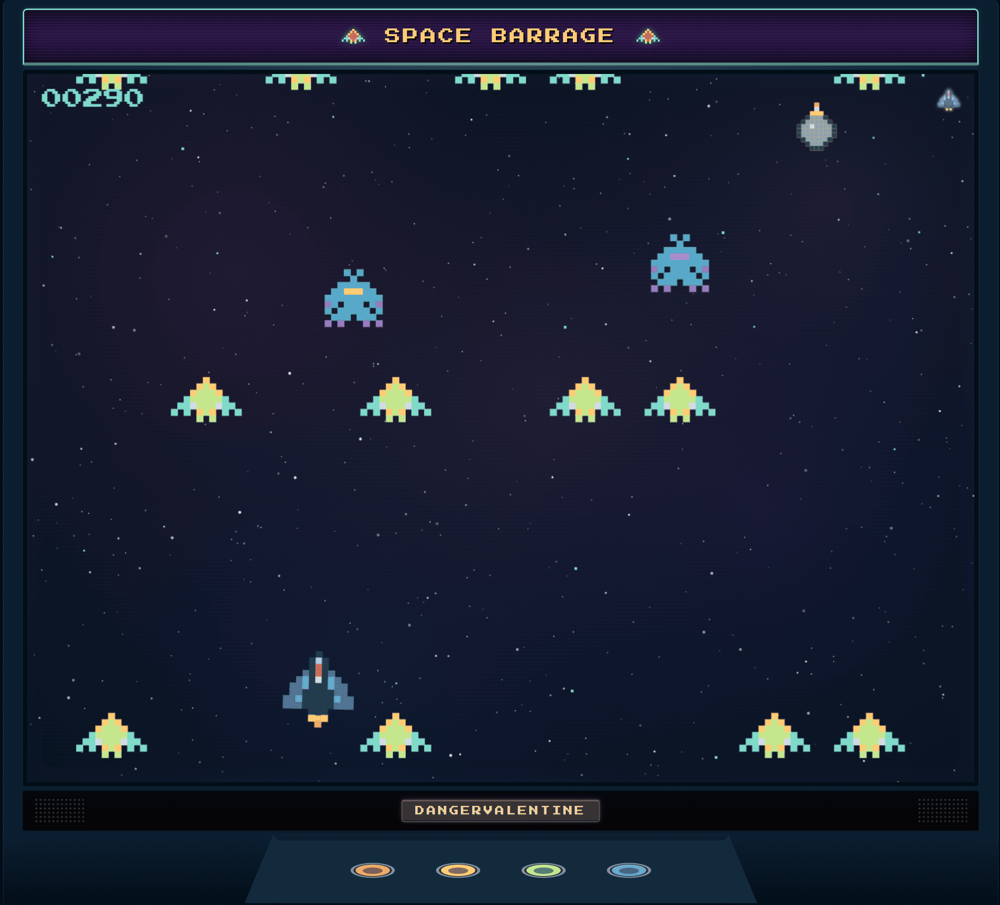

<p align="center">
  
</p>

<h1 align="center">Space Barrage</h1>

<p align="center">
  <strong>A pixel-art space shooter rendered entirely on HTML5 canvas, with escalating wave difficulty and an arcade-cabinet chrome.</strong>
</p>

<p align="center">
  <a href="https://dangervalentine.github.io/react-space-barrage/">Live Demo</a>
</p>

<p align="center">
  <a href="https://dangervalentine.github.io/react-space-barrage/">
    
  </a>
</p>

<p align="center">
  
  
  
  
  
</p>

---

Pilot a starship through an endless gauntlet of enemies. Waves spawn faster and denser as your score climbs, squid stalkers lock on and dive-bomb, and shield pickups keep you alive just long enough to push one tier further. Everything on screen is canvas-painted pixel art running inside a retro arcade cabinet frame.

## Features

**Two ship variants** &mdash; Choose between the classic interceptor (broad wings, pink cockpit) and the rocket (streamlined body, yellow viewport) on the title screen.

**Escalating difficulty** &mdash; A six-tier cycle repeats every 600 points. Each cycle adds more simultaneous enemies and cuts traversal time, with a hard floor so things stay playable. Wave spawn delay tightens per tier within each cycle.

**Squid stalkers** &mdash; After 20 points, squid enemies begin spawning. They drift laterally at hunt altitude, lock on when aligned with your ship, then dive at 1.5x grunt speed. Up to two active at once, with spawn chance ramping to 30% by score 200.

**Shield pickups** &mdash; Shield bombs start appearing after 50 points, falling through the play field. Fly into one to absorb the next hit. Particle burst on pickup.

**Particle explosions** &mdash; Ship death triggers a 60-particle blast with a lingering slow-core debris ring. Enemy kills pop a smaller 22-particle burst. Palette drawn from Night Owl accent tokens.

**Arcade cabinet chrome** &mdash; CRT-style quantization, scrolling nebula backdrop, perspective button row, virtual joystick on mobile, and a marquee header.

**Keyboard + touch** &mdash; Arrow keys or WASD to move, Space to fire. On mobile, a virtual joystick handles movement and the fire button sits on the right. Touch controls auto-hide on desktop.

**Accessibility** &mdash; Visually-hidden buttons mirror all canvas-painted interactive elements for screen readers. Pause and game-over states have full a11y mirrors.

## How It Works

The game loop runs in a single `requestAnimationFrame` callback. A `GameEngine` owns the simulation state and advances it by `dt` each frame; a `Renderer` paints the result onto two layered canvases (game field + cabinet chrome).

```
RAF tick
  │
  ├── GameEngine.update(dt)
  │     ├── Ship physics (acceleration, friction, velocity clamp)
  │     ├── Bullet spawning + movement (tilted by ship lean)
  │     ├── WaveManager cadence check
  │     │     └── DifficultyScaler.getTierForScore(score)
  │     │           ├── Cycle position → base tier (enemies, traverse speed)
  │     │           └── Cycle count → scaling (more enemies, faster)
  │     ├── Enemy movement (grunts: linear fall, squids: hunt → lock-on → dive)
  │     ├── Shield bomb spawning + fall
  │     ├── Collision detection (padded bounding boxes)
  │     ├── Particle simulation (velocity + lifetime decay)
  │     └── Score + lives bookkeeping
  │
  └── Renderer.draw(state, timestamp)
        ├── Nebula starfield backdrop
        ├── Pixel-art enemies (grunt + animated squid, health-tinted)
        ├── Pixel-art ship (11×11 grid, lean by velocity)
        ├── Flickering engine flame (2-frame animation)
        ├── Bullets, shields, particles
        ├── HUD (score, high score, lives)
        └── CRT scanline overlay + cabinet frame
```

Ship sprites are defined as 11x11 character grids where each character maps to a hex color from the Night Owl palette. The renderer walks the grid and `fillRect`s each pixel at the appropriate cell size.

## Quick Start

```bash
npm install
npm run dev        # dev server at http://localhost:5173/react-space-barrage/
npm run build      # type-check + production bundle in ./dist
npm run preview    # serve the production bundle locally
```

Vite's `base` is set to `/react-space-barrage/` in [`vite.config.ts`](./vite.config.ts) so assets resolve correctly on GitHub Pages. The same base path applies to the dev server URL.

## Tech Stack

- **React 19** &mdash; mounts the canvas, owns session state and UI overlays
- **Vite 6** &mdash; dev server, build, GitHub Pages base path
- **TypeScript 5** &mdash; strict mode, path aliases
- **Canvas 2D** &mdash; all gameplay rendering is canvas-painted pixel art
- **Night Owl** &mdash; dark theme color tokens shared between CSS and canvas

## Project Structure

```
src/
├── main.tsx                         React 19 createRoot entry
├── App.tsx                          Mount game + GitHub attribution
├── tokens.css                       CSS custom properties (Night Owl theme)
├── GithubAttribution.tsx            Bottom-right author + source link
│
├── arcade/                          Shared arcade cabinet infrastructure
│   ├── ArcadeCabinet.tsx            Cabinet frame, brand header, session orchestration
│   ├── ArcadeCanvas.tsx             Game-field canvas with DPR scaling
│   ├── JoystickCanvas.tsx           Virtual joystick (mobile touch input)
│   ├── useArcadeSession.ts          Title → playing → gameover state machine
│   ├── colors.ts                    Night Owl hex constants for canvas APIs
│   ├── nebula.ts                    Scrolling starfield backdrop
│   ├── renderer.ts                  CRT quantization + scanline overlay
│   ├── hud.ts                       Score, high score, lives display
│   ├── canvasUI.ts                  Canvas-painted buttons and text helpers
│   ├── arcadeFrame.ts               Cabinet border + perspective drawing
│   ├── designSize.ts                Virtual coordinate space constants
│   ├── todaysBest.ts                localStorage daily high score
│   └── PauseA11yMirror.tsx          Screen-reader mirror for pause state
│
├── game/                            Space Barrage game logic
│   ├── SpaceBarrageGame.tsx         Main game component (wires engine to cabinet)
│   ├── GameCanvas.tsx               Game canvas mount + input binding
│   ├── TouchControls.tsx            Mobile fire button overlay
│   ├── MarqueeArt.tsx               Pixel-art marquee header
│   ├── cabinetUI.ts                 Ship variant picker + title screen paint
│   ├── shipVariant.ts               Ship variant selection state
│   ├── LandingA11yMirror.tsx        Screen-reader mirror for title screen
│   ├── GameoverA11yMirror.tsx        Screen-reader mirror for game-over
│   └── engine/
│       ├── GameEngine.ts            Core simulation loop (physics, collisions, spawning)
│       ├── Renderer.ts              Pixel-art sprite definitions + paint pipeline
│       ├── WaveManager.ts           Wave spawn cadence timer
│       ├── DifficultyScaler.ts      Score → difficulty tier mapping
│       ├── tuning.ts                All numeric constants (speeds, timings, probabilities)
│       └── types.ts                 State interfaces + shared constants
```

## Deployment

CI is wired up via GitHub Actions:

- [`.github/workflows/deploy.yml`](./.github/workflows/deploy.yml) &mdash; builds and publishes to GitHub Pages on every push to `master`.

The deploy workflow uses the modern `actions/deploy-pages` flow (no `gh-pages` branch). One-time setup on the repo:

1. **Settings &rarr; Pages &rarr; Build and deployment &rarr; Source:** select **GitHub Actions**.
2. Push to `master` (or run the workflow manually from the Actions tab).

If you fork the repo, also update the `base` value in `vite.config.ts` to match your repo name.

## License

[MIT](./LICENSE.md)
